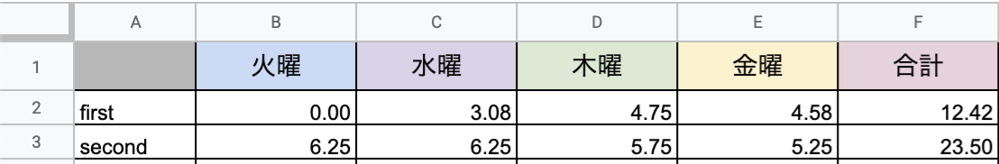

# calculation-working-time
スクラム用。Googleカレンダーから、スプリント内で使える作業可能時間を算出するスクリプト。

# 実行環境
GAS - Google Apps Script

# 準備する事
## Google Spread Sheet
- [workTime]という名前のシートを準備
- 下記の画像のように、1行目と、A列は各自で準備

## Google Calendar
- カレンダー上で出席する予定には、出席を登録

## Google Apps Script
### ライブラリ
- Moment
    - プロジェクトキー: MHMchiX6c1bwSqGM1PZiW_PxhMjh3Sh48
    - [リソース] -> [ライブラリ] -> [ライブラリを検索]にて上記のプロジェクトキーを追加
### 関数を実行する時
- 計算したい人のカレンダーを自分のカレンダー上に表示
    - 表示しておかないと、GASがカレンダーを取得出来ない。
### 計算する人を増やしたい時
- スクリプト内のmemberに人を追加
